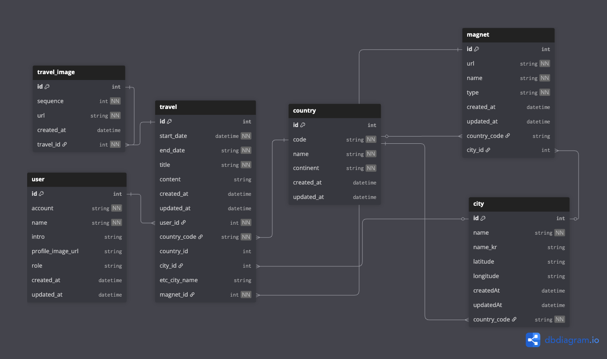

<p align="center">
  
</p>

## ERD 다이어그램



## 프로젝트 운영배포 파이프라인

## Project setup

> 프로젝트 초기 Docker-Compose
>
> - 목적: 로컬호스트에서도 별도의 소프트웨어 설치없이 빠르게 셋업
> - 로컬호스트에 접근할 수 있도록 DB관련 아이디, 패스워드 필요.
> - `.env` 파일에 있는 환경변수 필요 ([.env.sample](./.env.sample) 파일을 참고해주세요.)

```bash
# .env : Docker-Compose 에 필요한 환경변수들 셋팅

$ cp .env.sample .env
$ docker-compose up -d
```

<br>

> 패키지 의존성 설치

```bash
yarn install
```

## Compile and run the project

```bash
# development
$ yarn run start

# watch mode
$ yarn run start:dev

# production mode
$ yarn run start:prod
```

## Run tests

```bash
# unit tests
$ yarn run test

# e2e tests
$ yarn run test:e2e

# test coverage
$ yarn run test:cov
```
